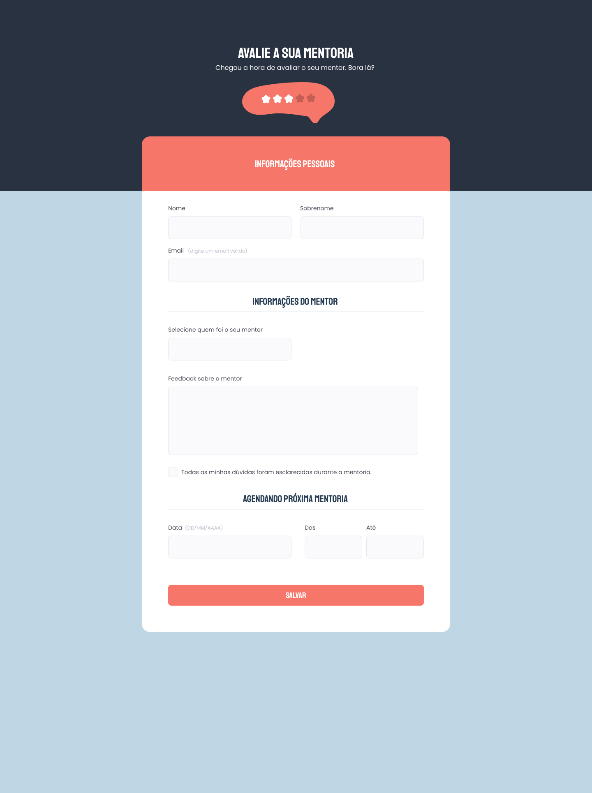

## 🖥️ Projeto

Formulário para avaliar mentoria

## ✍️ Aprendizagem

- Entendendo os campos HTML
- Como funcionam os formulários no HTML
- Simulando a busca do google
- Agrupando campos com fieldset e legend
- Formatando o campo do texto
-Ckeckbox costumizados

## 🚀 Tecnologias

Esse projeto foi desenvolvido durante o EXPLORER- programação web da Rocketseat com as seguintes tecnologias:

- HTML
- CSS

## 🏷️ Layout

Você pode visualizar o layout do projeto através
[desse link](https://www.figma.com/file/9JqxJa3PaoFqj0tDfXIHBA/Stage-03---Formul%C3%A1rio-avan%C3%A7ado-(Copy)?type=design&node-id=0%3A1&t=LgDnObcYakmONgj2-1).
É necessário ter uma conta no [Figma](https://www.figma.com/)

Feito com ❤️ por <strong>Luciana</strong>. Me acompanhe nas [redes sociais!](https://luciana-maria.github.io/Cartao-de-visita-Rocketseat/)
